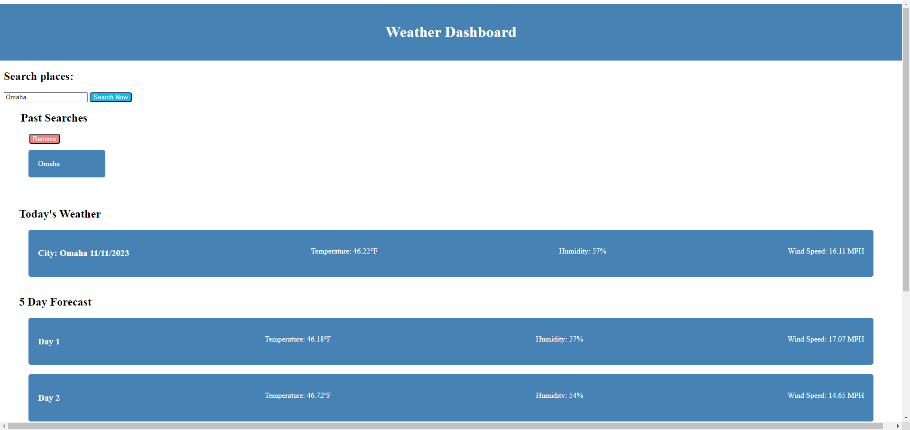

# Open Weather Dashboard

## open-weather-dashboard

## Description

This application leverages jQuery and DayJS, as well as open weather API's, to allow for looking up both the current and upcoming weather for a given city. This is a baisc HTML and CSS application that leverages the open weather data in the JS to get information and display on the site wrapped around jQuery.

## Table of Contents

- [Installation](#installation)
- [Usage](#usage)
- [Contribution](#contribution)
- [Tests](#tests)
- [License](#license)
- [Questions](#questions)

## Installation

Simply clone the repository and begin making any modifications you'd like, we don't have any real dependencies except for linking your stylesheets and scripts for DayJS and jQuery.

## Usage

Enter city to search, displays both current and future (up to 5 days) weather report for the destination. Information is saved in Local Storage as "past searches" and will remain after refresh of hte page. This can be cleared from Local Storage using the Remove button.

## Contribution

N/A

## Tests

N/A

## License

N/A

## Questions

You can reach me at danielwatkins@byu.net or find me at https://github.com/dan-watkins
